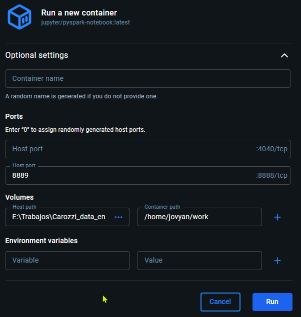
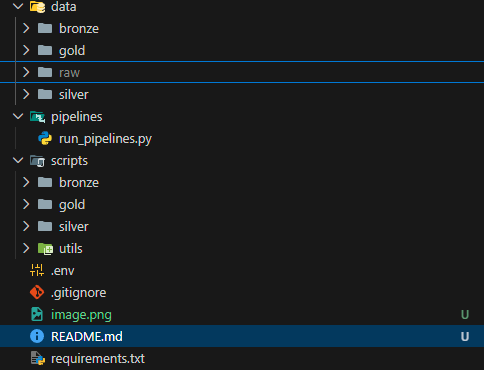
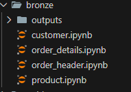
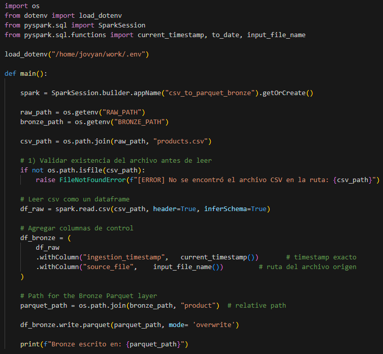
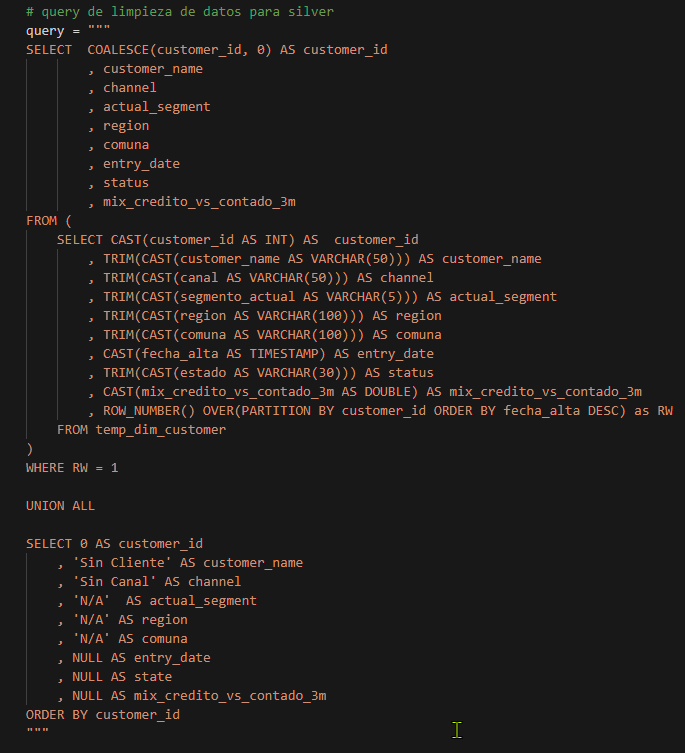
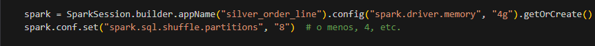
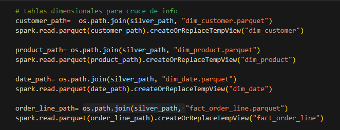
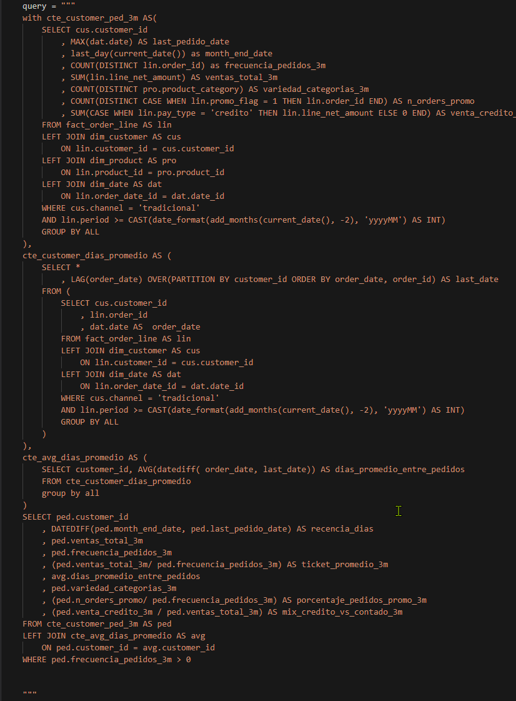

* Instrucciiones de instalacion

# Desafio Data Engineer
El objetivo es resolver un desafío simulado utilizando datos generados sintéticamente, con el objetivo de evaluar capacidades en el contexto de la resolución de un problema y presentación de resultados en el proceso de postulación al cargo de Data engineer en Carozzi.

## Descipcion del Problema
La compañía vende a clientes del canal tradicional (almacenes, botillerías, kioscos, etc.) a través de un canal de ventas transaccional. El equipo de Analítica Avanzada necesita construir un modelo de segmentación de clientes y necesita una vista consolidada a nivel cliente, con características (features) calculadas a partir de las transacciones históricas solicitada por los data scienstist del área para generar este modelo de segmentación de clientes. 

`Objetivo: Diseñar e implementar una arquitectura del tipo medallion usando PySpark, ejecutable lcalmente, que genere en la capa Gold dim_feature (tabla de caracteristicas del cliente calculadas en los ultimos 3 meses de datos transaccionales de ventas)`

Los origenes de datos son archivos planos almnacenados en la carpeta ./data/raw.

## Data disponible
* ``orders_header.csv`` Encabezados de ordenes.
* ``orders_detail.csv`` Detalles de ordenes.
* ``products.csv`` Maestro de productos
* ``customers.csv`` Maestro de clientes

## Arquitectura propuesta
La Arquitectura Medallion es un patrón de diseño para construir data lakehouses modernos mediante capas lógicas de datos. Organiza el flujo de transformación en tres niveles: Bronze, Silver y Gold, donde cada capa representa un grado mayor de calidad, limpieza y valor analítico.

Su objetivo es:

* Mejorar la calidad del dato de forma incremental.
* Simplificar la trazabilidad del pipeline.
* Crear datasets reutilizables, consistentes y confiables.
* Separar responsabilidades de ingesta, limpieza y consumo analítico.
* Facilitar auditoría, reprocesamientos y escalabilidad.

### Capa Bronze - Datos crudos.
La capa Bronze contiene datos tal como llegan desde sus fuentes, con la mínima transformación posible.
Equivale a un "single source of truth" dentro del lakehouse.

#### Características:

* Datos crudos, semiestructurados o estructurados.
* Conserva valores originales (incluye errores, duplicados, nulos).
* Permite reconstruir cualquier proceso upstream.
* Es ideal para auditoría y trazabilidad.

### Capa Silver - Datos limpios, validados y listos para analisis.
En silver se refinan y estandarizan los datos desde Bronze. Se aplican reglas de negocio básicas, limpieza de los mismos y normalizacion. El objetivo es crear datasets consistentes y unificados, aptos para consumo interno o como insumo para modelos analíticos. Usulamente aqui se construyen tablas dimensionales.

### Capa Gold — Datos analíticos y métricas listas para negocio
La capa Gold contiene datasets curados y diseñados para entregar valor al negocio: reportes, dashboards, analítica avanzada y machine learning.

## Desarrollo de Desafío
### Tecnología utilizada:
* Python 3.10+
* PySpark
* JupyterLab
* Papermill (para ejecutar notebooks de forma programática)
* Docker / Docker Compose
* Parquet
* Arquitectura Medallion (Bronze / Silver / Gold)

### Instrucciones de instalacion.
* Descargar Docker Desktop.
* Buscar imagen jupyter/pyspark-notebook en Docker Hub[https://hub.docker.com/r/jupyter/pyspark-notebook
* Clonar repo Github
* Montar un nuevo contenedor con la imagen descargada, con los siguientes parametros
  * Port: 8889:8888
  * Volume: <github_repo_local_path>:/home/jovyan/work

* Luego, en el entorno de desarrollo ``http://127.0.0.1:8889/lab``, abrir una nueva terminal e instalar ``pip install -r requirements.txt``
* Finalmente, para ejecutar todo ejecutar la instruccion ``python run_pipelines.py`` dentro de la carpeta ``pipelines``

### Esquema propuesto de organizacion de Desarrollo

* data: Contiene los datos de input y output de todo el proceso.
  * data/raw: Origenes de datos.
  * data/bronze: Datos de bronze organizados por archivos cargados.
  * data/silver: Datos Silver de tablas parquet Dimensionales.
  * data/gold: Datos gold de tablas parquet solicitada como entregables.
* scripts: Carpeta que contiene el codigo hecho en notebooks (Jupyter Notebooks) para la ingesta. Esta separada por etapas del medallon y cada archivo es la carga de una tabla en especifico
* pipelines:  Carpeta que contiene archivo de orquestador.

## Scripts - Bronze:
Para la capa bronze se sigue los lineamientos otorgados por la arquitectura de mantener los datos crudos, unificado cada tabla en archivos parquet y organizados por fuente de origen. En esta etapa se toman desiciones mas de trazabilidad del dato y tiempos en la ingesta y ejecucion del proceso. Todas las ejecuciones son con la opcion overwrite, pensando en que siempre esta capa va a tener los datos de entrada a ingestar.

Cada uno de estos archivos contiene instrucciones en PtSpark para cargar la data en Dataframes y luego escribir estos en un formato de salida Parquet. Para los casos de customer y product el codigo es sensillo, es mas directa la lectura porque son archivos de peso pequeño y no esta fragmentado su origen.

Para el caso de ``order_details`` y ``order_header`` como tenemos la data dispersada en variados archivos se opta por generar las cargas con wildcard que permiten hacer coincidencias más flexibles en un patrón de búsqueda.

Todos estos resultados son almacenados como parquet en la ruta ``data/bronze/``.

## Scripts - Silver:
En la capa siler se respetan las transformaciones solicitadas en el enunciado del problema. Para el manejo del set de datos se opta por sentencias SQL dado la experiencia con que el desarrollador cuenta para solucionar temas de preparacion y explotacion de la informacion. Para ello primero se carga un DataFrame en spark y luego con la instruccion ``createOrReplaceTempView`` se procede a generar una tabla temporal consultable con expresiones SQL.

Aqui ademas en esta parte del codigo se generan las expresiones de transformacion y normalizacion de la data, ademas para el caso de las dimensiones se agregan datos Dummy para los casos de filas que no crucen con clientes o productos. Para el caso de las tablas de hecho se generan 2, ``fact_order_line`` y ``fact_order``. 

Ademas en la data de ``fact_order_line`` se tuvo que optimizar el proceso de carga de datos y de escritura, aumentando la cantidad de memoria disponible y mejorando la cantidad de particiones a utilizar.

Cada script en esta carpeta refleja los procesos y codigos de carga de una tabla en silver.

## Scripts - Gold:
En esta capa se genera la tabla adicional ``dim_features`` requerida en el desafio. Para lograrlo se utilizó SparkSQL en el cruce de informacion. Previo a esto primero se carga la data en tablas temporales.

Luego se procede con la construccion de la consulta SQL que logra crear la tabla necesaria para completar el desafio.

### **Diccionario de datos Final ``dim_features``**

| Campo                         | Tipo       | Descripción funcional                                                                                                      | Cálculo / Origen                                                                                                                                                               | Ejemplo              |
| ----------------------------- | ---------- | -------------------------------------------------------------------------------------------------------------------------- | ------------------------------------------------------------------------------------------------------------------------------------------------------------------------------ | -------------------- |
| `customer_id`                 | int | Identificador único del cliente.                                                                                           | `cus.customer_id` desde `dim_customer`, canal = `'tradicional'`.                                                                                                               | `12345`              |
| `recencia_dias`               | int        | Días de recencia: cuántos días han pasado desde el último pedido del cliente hasta el último día del mes actual.           | `DATEDIFF(ped.month_end_date, ped.last_pedido_date)` donde `last_pedido_date = MAX(dat.date)` y `month_end_date = last_day(current_date())`                                    | `12`                 |
| `ventas_total_3m`             | decimal    | Monto total neto vendido al cliente en los últimos 3 meses (suma de todas las líneas de pedido).                           | `SUM(lin.line_net_amount)` en la CTE `cte_customer_ped_3m` para los últimos 3 meses (`lin.period >= yyyymm hace 2 meses`).                                                     | `250000.50`          |
| `frecuencia_pedidos_3m`       | int        | Número de pedidos distintos realizados por el cliente en los últimos 3 meses.                                              | `COUNT(DISTINCT lin.order_id)` en `cte_customer_ped_3m`.                                                                                                                       | `8`                  |
| `ticket_promedio_3m`          | decimal    | Ticket promedio del cliente en los últimos 3 meses (monto promedio por pedido).                                            | `ped.ventas_total_3m / ped.frecuencia_pedidos_3m`.                                                                                                                             | `31250.06`           |
| `dias_promedio_entre_pedidos` | decimal    | Días promedio entre pedidos consecutivos del cliente en los últimos 3 meses.                                               | En `cte_customer_dias_promedio`: `LAG(order_date)` por `customer_id`; luego en `cte_avg_dias_promedio`: `AVG(datediff(order_date, last_date))`.                                | `9.3`                |
| `variedad_categorias_3m`      | int        | Variedad de categorías de producto compradas por el cliente (número de categorías distintas) en los últimos 3 meses.       | `COUNT(DISTINCT pro.product_category)` en `cte_customer_ped_3m`.                                                                                                               | `4`                  |
| `porcentaje_pedidos_promo_3m` | decimal    | Proporción de pedidos del cliente que tuvieron al menos una línea en promoción en los últimos 3 meses.                     | `ped.n_orders_promo / ped.frecuencia_pedidos_3m`, donde `n_orders_promo = COUNT(DISTINCT CASE WHEN lin.promo_flag = 1 THEN lin.order_id END)`. Valores entre `0` y `1`.        | `0.25` (25%)         |
| `mix_credito_vs_contado_3m`   | decimal    | Proporción de las ventas del cliente pagadas con crédito respecto al total vendido en los últimos 3 meses (mix por monto). | `ped.venta_credito_3m / ped.ventas_total_3m`, donde `venta_credito_3m = SUM(CASE WHEN lin.pay_type = 'credito' THEN lin.line_net_amount ELSE 0 END)`. Valores entre `0` y `1`. | `0.65` (65% crédito) |

**Nota:** Todo el resultado final es bajo una ventana temporal de últimos 3 meses incluyendo el mes actual, definida por
``lin.period >= CAST(date_format(add_months(current_date(), -2), 'yyyyMM') AS INT)``.

## Migrar o escalar a Azure/Fabric
Una de las ventajas de utilizar Fabric es que toda la arquitectura esta basado en sistemas distribuidos de almacenamiento, usando tecnologia **Delta Tables**, lo que permite garantizar instrucciones ACID, time travel, mantencion de archivos con optimize y vacuum, todo administrado ademas por Fabric, lo que lo hace en un entorno ideal para Data Engineering y IA.

### Optimizaciones en Fabric.
* Uso de Delta Tables
* Uso de Runtimes de Spark administrado.
* OneLake + Delta tables en la organizacion y almacenamiento de tablas
* Orquestacion con Data Factory para orquestacion.
* Copy Data para ingestas en ambientes Raw
* Notebooks para tratamiento de las capas del medallon
* Posibilidad de creacion de funciones SCD para tratamiento de cambios historicos en Silver.
* PySpark y SparkSQL es totalmente compatible con Fabric.